<h1 align="center">Lets Talk - Chat Realtime</h1>
<p align="center">
  
  
</p>
<p align="center">
  Built with React Native & Firebase
</p>

## Table of Contents

- [Introduction](#introduction)
- [Features](#features)
- [Requirements](#requirements)
- [Usage](#usage-for-development)
- [Create Environment Variable](#create-environment-variable)
- [Screenshots](#screenshots)
- [Release APK](#release-apk)
- [Contact](#contact)
- [Contributors](#contributors)

## Introduction

<b>Lets Talk</b> is a Mobile application that can be used to chat with each other and track the location of friends in realtime.

## Features

- Users must sign up and sign in to use this application
- Users must add friends to each other to chat
- Users can track the location of friends
- And others

## Requirements

- [`npm`](https://www.npmjs.com/get-npm)
- [`react-native`](https://facebook.github.io/react-native/docs/getting-started)
- [`react-native-cli`](https://facebook.github.io/react-native/docs/getting-started)

## Usage for development

1. Open your terminal or command prompt
2. Type `git clone https://github.com/ihsan2/LetsTalk---Chat-Realtime.git`
3. Open the folder and type `npm install` for install dependencies
4. Create Environment Variable [here](#create-environment-variable)
5. Type `react-native run-android` for run this app. **_Make sure your device is connected with debugging mode_**.

## Create Environment Variable

```
$ cp .env.example .env
$ nano .env
```

```
# Set Firebase Config
apiKey='YOUR_apiKey_FIREBASE'
authDomain='YOUR_authDomain_FIREBASE'
databaseURL='YOUR_databaseURL_FIREBASE'
projectId='YOUR_projectId_FIREBASE'
storageBucket='YOUR_storageBucket_FIREBASE'
messagingSenderId='YOUR_messagingSenderId_FIREBASE'
appId='YOUR_appId_FIREBASE'
measurementId='YOUR_measurementId_FIREBASE'
```

## Screenshots

<div align="center">
    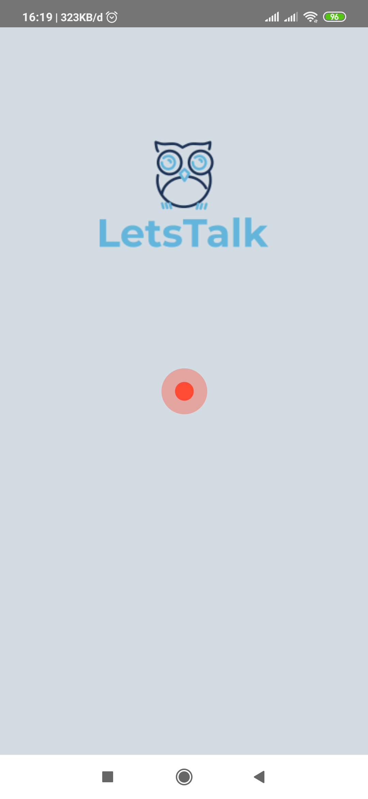   
    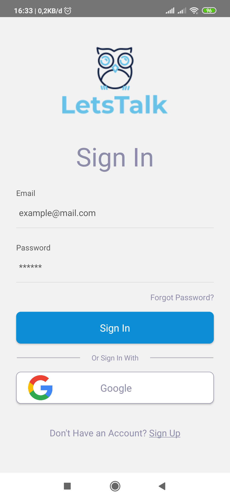
    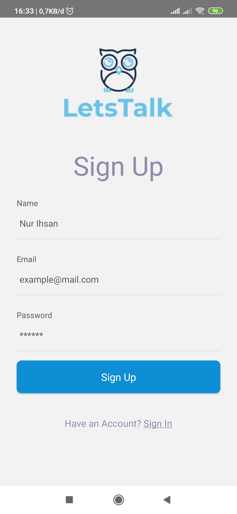
</div>
<div align="center">  
    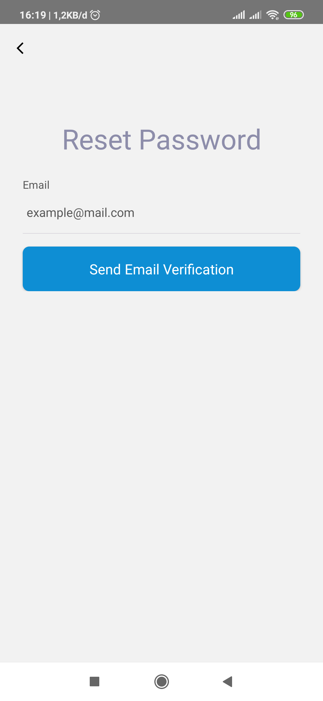   
    
    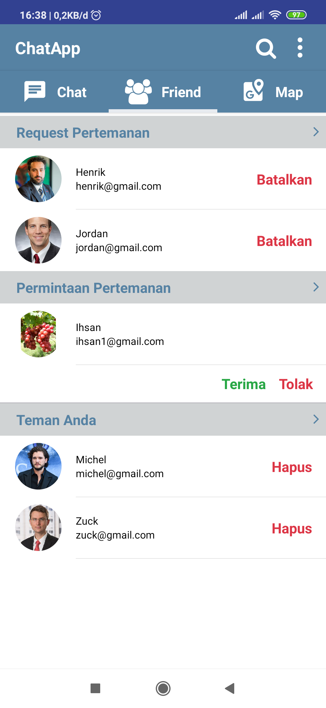
</div>
<div align="center">  
    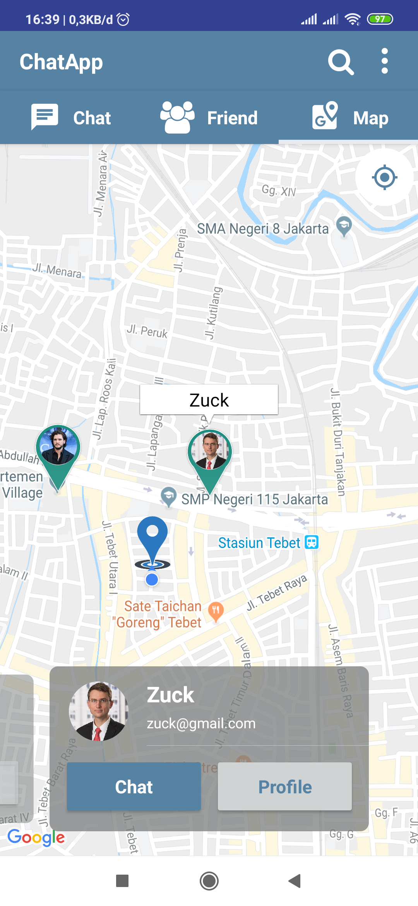   
    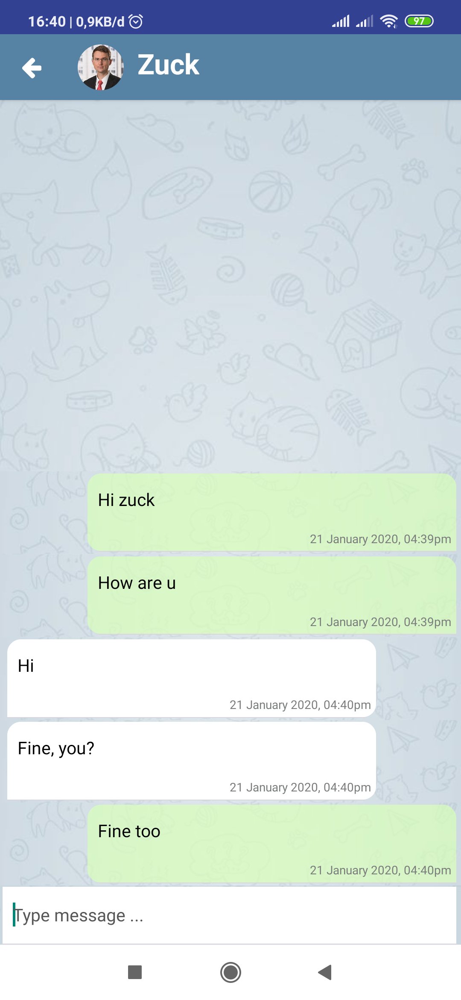
    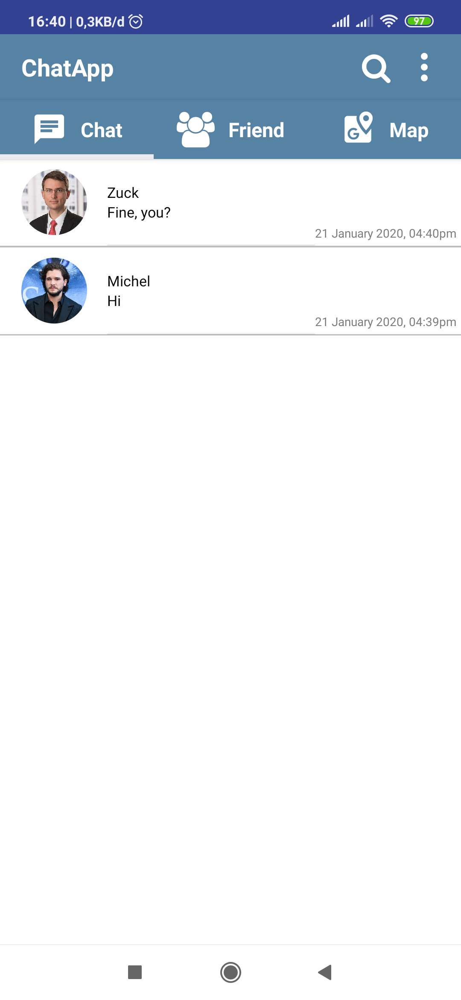
</div>
<div align="center">  
    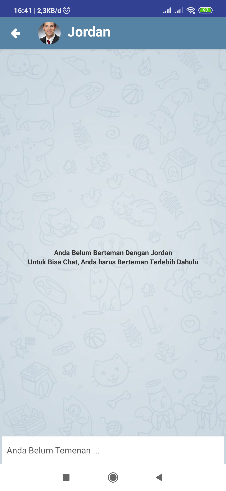   
    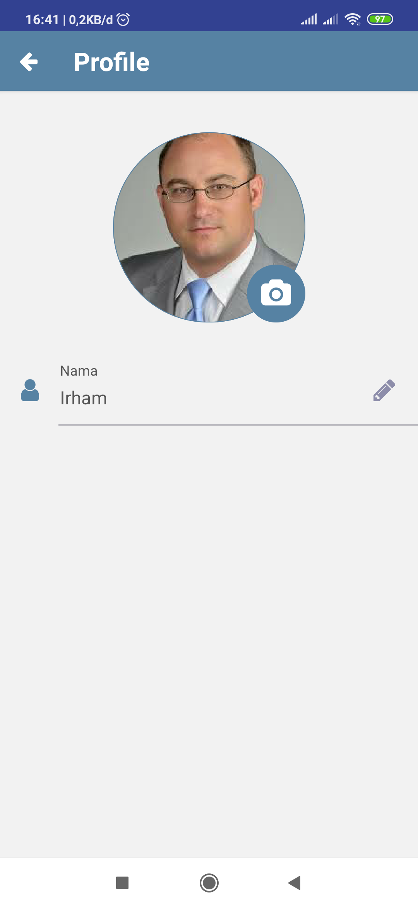
    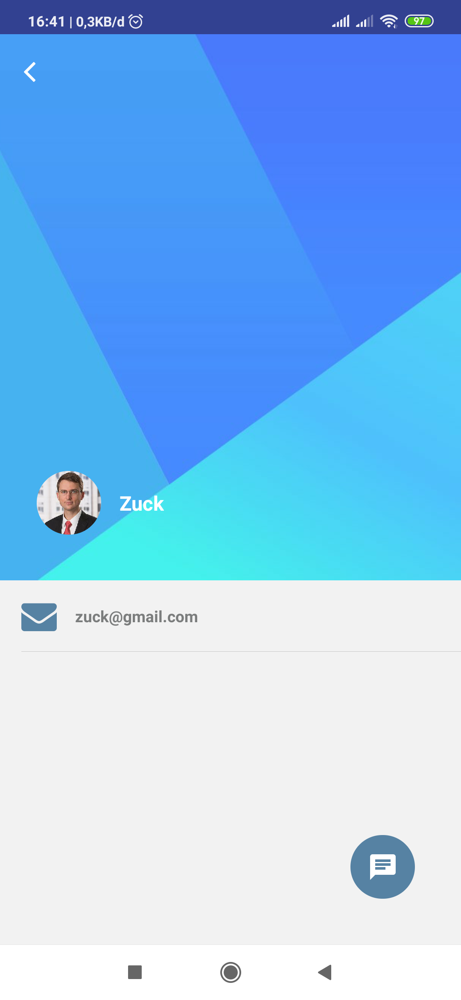
</div>

## Release APK

<a href="http://bit.ly/LetsTalk-v1">
  
</a>

## Contact

If you want to contact me you can reach me at <nihsan727@gmail.com>.

Copyright © 2020 by Nur Ihsan

## Contributors

<center>
  <table>
    <tr>
      <td align="center">
        <a href="https://github.com/ihsan2">
          <br/>
          <sub><b>Nur Ihsan</b></sub>
        </a>
      </td>
    </tr>
  </table>
</center>
